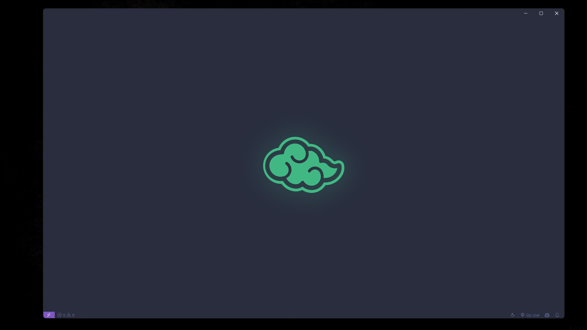
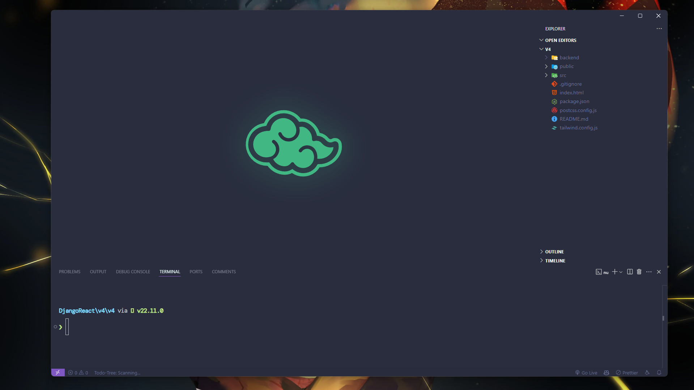

# 🚀 Ultimate VS Code Setup

A carefully curated VS Code configuration for an optimal development experience. This setup includes custom keybindings, snippets, and carefully selected settings to enhance your coding workflow.

## 📸 Preview

Here's how your VS Code will look after applying these settings:






## ⚡ Quick Start

1. Install the required font:
   - [DM Mono](https://fonts.google.com/specimen/DM+Mono)

2. Install recommended VS Code extensions:
   - Material Icon Theme
   - Prettier
   - ESLint
   - Todo Tree
   - GitHub Copilot
   - Tailwind CSS IntelliSense
   - Custom CSS and JS Loader
   - Toggle

3. Copy the configuration files:
   - `settings.json` → `.vscode/settings.json`
   - `keybindings.json` → VS Code Keyboard Shortcuts
   - `snippets.code-snippets` → VS Code User Snippets
   - `custom.css` → Your custom CSS location (update path in settings)

4. Configure Windows Terminal:
   - Copy the `term_setting.json` file to your Windows Terminal settings location:
     - Open Windows Terminal
     - Press `Ctrl + ,` to open the settings
     - Click on the "Open JSON file" button
     - Replace the content with the content of `term_setting.json`
     - Save and close the file

5. Enable Custom CSS and JS:
   - After installing the Custom CSS and JS Loader extension:
   - Press `Ctrl/Cmd + Shift + P`
   - Type "Enable Custom CSS and JS"
   - Select and run the command
   - VS Code will restart
   - If you see a warning about VS Code being "corrupt", this is normal:
     - Click "Don't Show Again"
     - This warning appears because the extension modifies VS Code's files to enable custom styling
     - It's completely safe to ignore

6. Reload Custom CSS and JS (if changes don't appear):
   - Press `Ctrl/Cmd + Shift + P`
   - Type "Reload Custom CSS and JS"
   - Select and run the command
   - VS Code will restart
   - Your changes should now be visible

## 🎨 Features

### Editor Aesthetics
- Clean, minimal interface
- Hidden line numbers
- Smooth cursor animations
- Custom font: DM Mono
- Autohiding minimap
- Hidden activity bar
- Right-sided sidebar
- Custom SVG background watermark

### Typography
- Font: DM Mono
- Editor font size: 20px
- Line height: 70px
- Terminal font size: 15px
- Font ligatures enabled

### Smart Features
- Format on save
- Smooth scrolling
- Intelligent suggestions
- Multi-cursor support
- Custom word separators
- File associations for env files

### Terminal Integration
- Multiple shell support (PowerShell, CMD, Git Bash, Nu Shell)
- Custom font and sizing
- Split terminal support
- Integrated terminal customization

### Code Organization
- Todo Tree with custom tags and highlighting
- Smart file exclusions
- Tailwind CSS IntelliSense
- Language-specific formatting
- Custom snippets for productivity

## ⌨️ Key Bindings

### General Navigation
- `Ctrl + K Ctrl + E` → Explorer panel
- `Ctrl + K Ctrl + G` → Source Control
- `Ctrl + K Ctrl + D` → Debug panel
- `Ctrl + K Ctrl + X` → Extensions
- `Ctrl + B` → Toggle sidebar
- `Ctrl + T` → Toggle terminal

### Editor Controls
- `Ctrl + K Ctrl + K` → Toggle font size
- `Shift + Ctrl + [/]` → Fold/Unfold code
- `Ctrl + L` → Duplicate line
- `Ctrl + J` → Join lines

### Multi-Cursor & Selection
- `Ctrl + Backspace` → Previous match
- `Ctrl + K Ctrl + D` → Next match
- `Ctrl + Right` → End of line cursors

### Panel Management
- `Alt + W` → Join panels
- `Alt + N` → Split editor
- `Alt + L/H` → Navigate panels
- `Alt + =/−` → Resize panels

### Terminal Operations
- `Alt + N` → Split terminal
- `Alt + L/H` → Navigate splits
- `Alt + W` → Kill terminal

## 🎯 Snippets

### General
- `line-seperator` → Create a line separator
- `line-small-seperator` → Create a small line separator
- `line-block-title` → Create a title block

### Python
- `multi_comment` → Python multi-line comment
- `py-def` → Function definition with docstring
- `py-class` → Class definition with docstring

## 🛠️ Customization

### Theme
The setup uses:
- Icon Theme: Material Icon Theme
- Color Theme: Palenight Italic

### Custom CSS
Custom styling is applied through `custom.css`. Update the path in settings:
```json
"vscode_custom_css.imports": [
    "file:///path/to/your/custom.css"
]
```

### Custom Background SVG
The setup includes a custom SVG background watermark. To modify it:

1. Create your SVG design using any vector graphics editor
2. Convert your SVG to a Data URI:
   - Use an online SVG to Data URI converter
   - Visit [SVG to Data URI Converter](https://www.svgviewer.dev/svg-to-data-uri) or similar tools
   - Paste/Upload your SVG code/file and get the Data URI version

3. Replace the existing Data URI in `custom.css`:
```css
.monaco-workbench.vs-dark
  .part.editor
  > .content
  .editor-group-container
  .editor-group-watermark
  > .letterpress {
  background-image: url("YOUR_DATA_URI_HERE") !important;
}
```

4. Adjust the size if needed:
```css
.monaco-workbench.vs-dark
  .part.editor
  > .content
  .editor-group-container
  .editor-group-watermark
  > .letterpress {
  height: 300px !important;
  width: 600px !important;
}
```

## 📝 Notes

- Some settings are OS-specific (particularly for macOS, Windows, and Linux)
- Window title bar style varies by OS and desktop environment
- Font installation is required for optimal experience
- Custom CSS requires the Custom CSS and JS Loader extension
- SVG background modifications require the Custom CSS and JS Loader extension to be enabled
- If custom styles don't appear after changes, use the "Reload Custom CSS and JS" command
- The "VS Code is corrupt" warning is normal and can be safely ignored

## 🤝 Contributing

Feel free to submit issues and enhancement requests!
